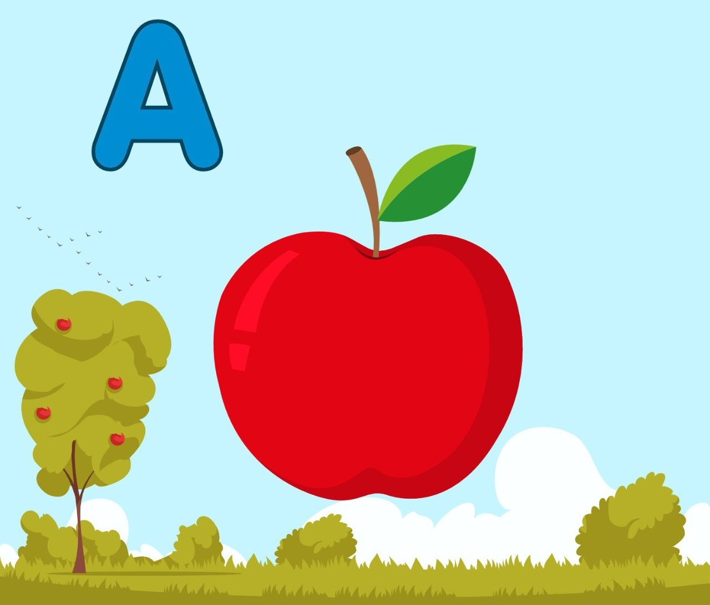
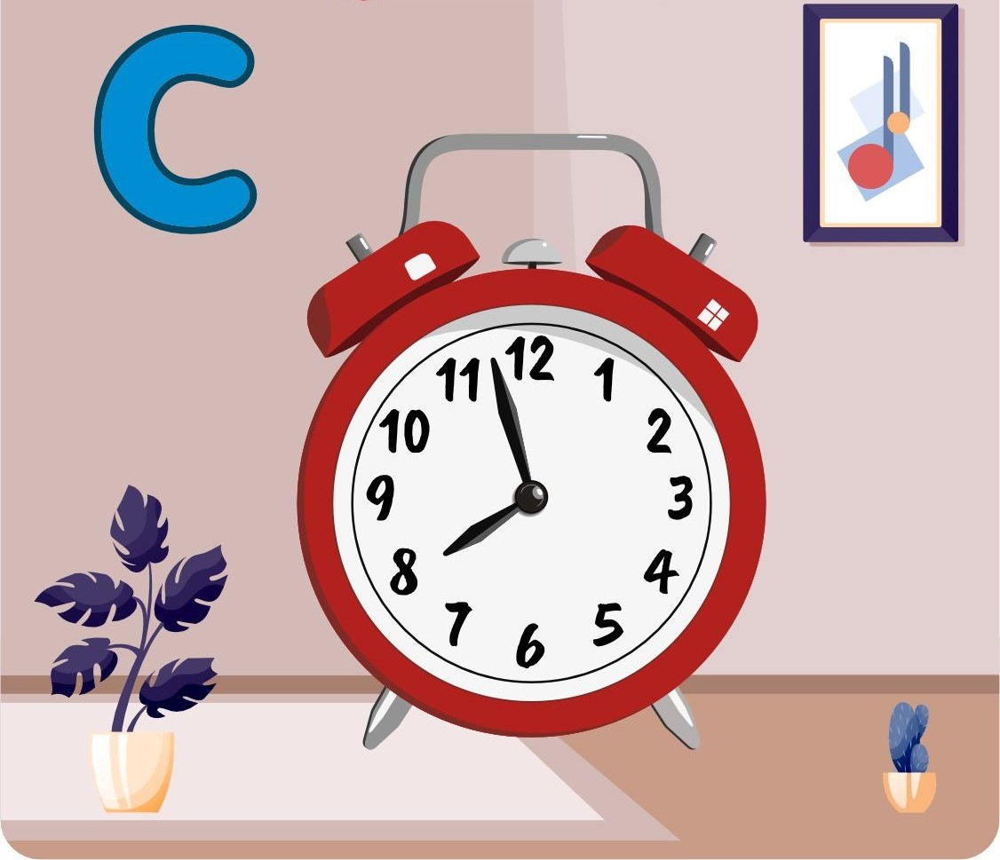

## Alphabet in Augmented Reality

Our project "Alphabet in Augmented Reality" is an innovative and interactive way for children to learn the alphabet. Using augmented reality technology, each letter of the alphabet is brought to life through an engaging and interactive experience.

## 🔗 APP Link
[![App Link]](https://drive.google.com/drive/u/0/folders/1VHlDCe4mFjjYb2RHD6dWfUxB1NJlvBnx?lfhs=2)

## App marker

